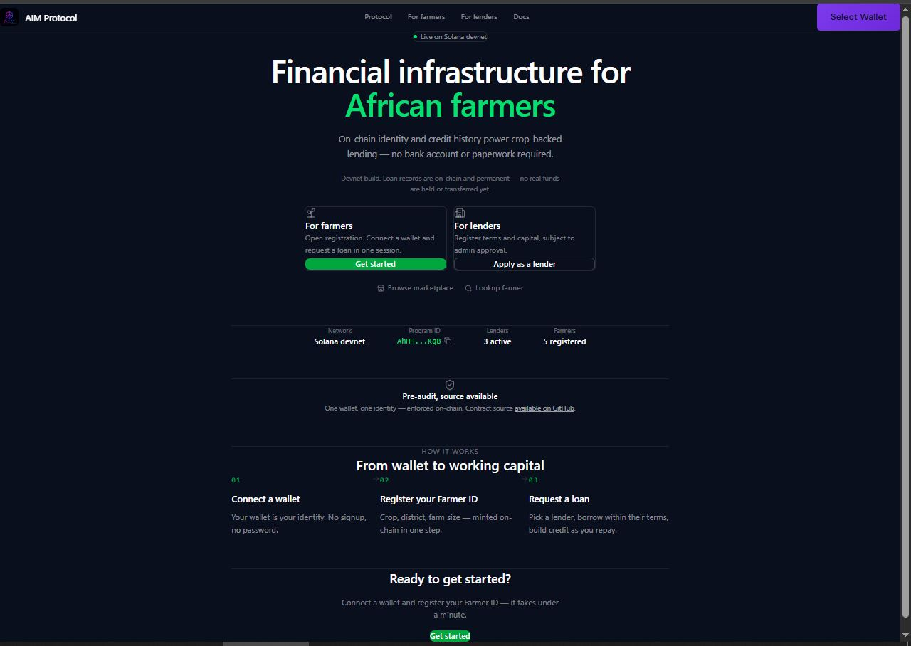
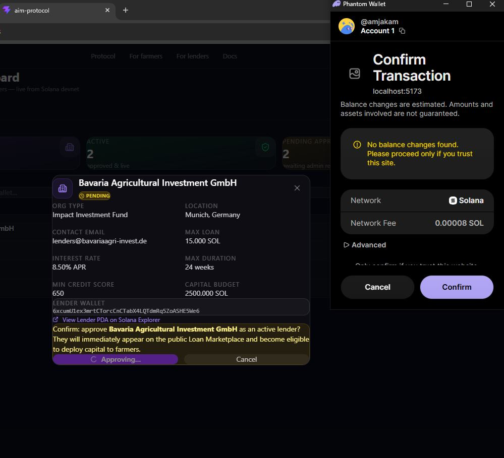
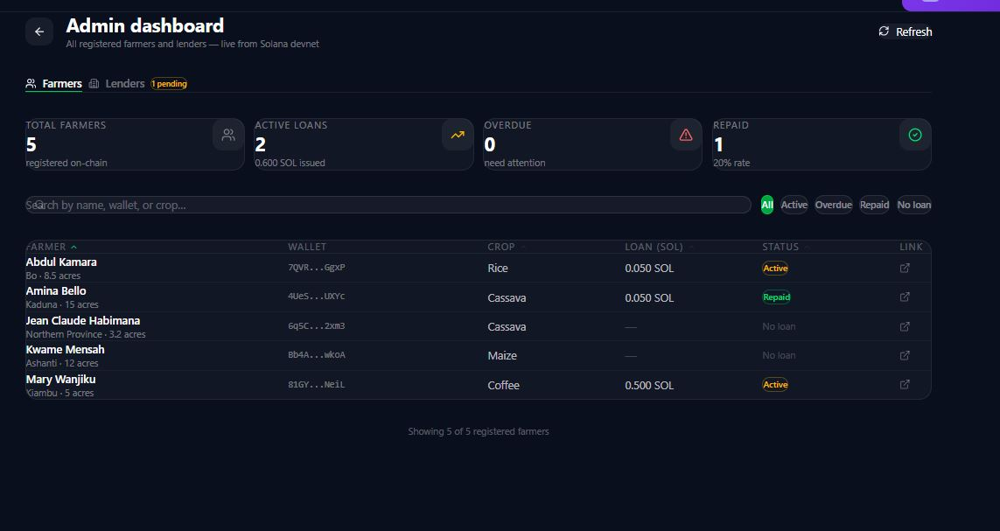

# AIM Protocol

> Financial infrastructure for African farmers — built on Solana.

[](https://aim-protocol.vercel.app/)
[](https://explorer.solana.com/address/AhHHJTu5vodDYE2yLNet2bE6jad9F3xSfbLQdUmykKqB?cluster=devnet)
[](https://github.com/amjadkamara/aim-program)
[](https://github.com/amjadkamara/aim-protocol/tree/master/docs/release-notes)

## What is AIM Protocol?

AIM Protocol is a decentralized microfinance platform connecting smallholder farmers across Africa to DeFi financial services. Farmers establish a verifiable on-chain identity, request crop-backed microloans, track their loan history, and build an on-chain credit record — no bank account, collateral, or paperwork required. Approved lenders (NGOs, cooperatives, MFIs) register, get admin-approved, and deploy capital against transparent, published terms on a public marketplace.

Originally built for the Solana Frontier Hackathon 2026. Now in active post-hackathon development toward real-world deployment across Africa.

📄 **Full version history and technical release notes:** [`/docs/release-notes`](https://github.com/amjadkamara/aim-protocol/tree/master/docs/release-notes)

## The Problem

Over 60% of Africa's workforce depends on agriculture, yet smallholder farmers remain almost entirely excluded from formal financial systems — not because the need isn't there, but because the infrastructure was never built for them.

Traditional lending requires collateral they don't have, processes that take weeks, and interest rates of 30–60% annually that make farming unprofitable. The result: farms abandoned, food prices rising, youth leaving rural areas for cities.

**Blockchain solves this:**

- A wallet replaces a bank account — anyone with a phone can participate
- On-chain identity replaces collateral documentation
- Smart contracts replace loan officers — rules enforced transparently
- Transaction history on-chain creates a credit record over time

## Live Demo

🌍 **[https://aim-protocol.vercel.app/](https://aim-protocol.vercel.app/)**

> Connect a Phantom wallet set to **Solana Devnet** to interact with the live smart contract.
> Free devnet SOL available at [faucet.solana.com](https://faucet.solana.com)

## Screenshots

| Homepage                                                               | Lender approved (on-chain)                                                                                | Admin — Farmers                                                                                       |
| ---------------------------------------------------------------------- | --------------------------------------------------------------------------------------------------------- | ----------------------------------------------------------------------------------------------------- |
|  |  |  |

Full documented journey — registration, loan lifecycle, admin, and lender flows — in [`/docs/screenshots`](https://github.com/amjadkamara/aim-protocol/tree/master/docs/screenshots)

## What's Built — V2.3.1

The platform now covers three stakeholder roles — farmers, lenders, and the protocol admin — with a full loan lifecycle enforced on-chain.

### Smart Contract (Rust + Anchor)

- **PDA enforcement** — one wallet, one Farmer ID or Lender account, enforced on-chain. Duplicate registration is impossible; farmer and lender roles are mutually exclusive at the contract level.
- **Lender registration and approval** — `register_lender` and `approve_lender` instructions are live on-chain; admin approval immediately activates a lender on the public marketplace.
- **Full loan lifecycle** — request, repay, re-borrow. Repayment correctly flags the loan `is_repaid` before account closure, keeping the record accurate on the farmer dashboard and admin stats.
- **Admin role lockout** — the admin wallet is blocked from registering as either a farmer or a lender, enforced by contract-level checks.
- **Full test suite** — 5/5 passing: create, duplicate block, request, active loan block, repay and close.
- **Stable Program ID** — `AhHHJTu5vodDYE2yLNet2bE6jad9F3xSfbLQdUmykKqB` has not changed since the hackathon submission; every version since has upgraded the existing deployment rather than redeploying.

### Frontend (React + Vite)

- **Farmer ID registration** — on-chain identity with name, crop type, district, farm size. Detects existing registration instantly.
- **Lender registration** — 3-step onboarding for NGOs, cooperatives, and MFIs: organisation details, loan terms and capital, review and submit. Admin-approved before appearing on the marketplace.
- **Loan Marketplace** — public, no wallet required. Browse approved lenders and their published terms before connecting.
- **Public Farmer Profile lookup** — anyone can look up a farmer's on-chain identity and loan status by wallet address, no connection required.
- **Loan Dashboard** — real-time loan status showing Active / Overdue / Repaid with days remaining and deadline. Loan requests constrained to the selected lender's declared terms.
- **Admin Dashboard** — wallet-gated, live farmer and loan data pulled directly from devnet: aggregate stats, sortable/searchable farmer table, status filters, dedicated Farmers and Lenders tabs.
- **Repay Loan UI** — full repayment screen with on-chain transaction via Phantom.
- **Loan History** — complete borrowing record parsed from Solana transaction history, with per-loan Solana Explorer links.
- **Plain English errors** — `parseAnchorError()` maps all Solana/Anchor errors to farmer-readable messages.
- **Enterprise UI design system** — flat, single-accent visual language across all core screens; no hackathon references or decorative gradients on the live product.
- **Mobile responsive** — tested at 375px across all screens.

## User Flow

```
Connect Wallet
     ↓
Create Farmer ID  ─or─  Register as Lender (admin-approved)
     ↓
My Dashboard (profile + loan status)  /  Marketplace (browse lenders)
     ↓
Request Microloan (within chosen lender's terms)
     ↓
Repay Loan (account flagged repaid, rent returned on close)
     ↓
View Loan History (on-chain transaction record)
     ↓
Re-borrow (seamless cycle)
```

## Tech Stack

| Layer          | Technology                       |
| -------------- | -------------------------------- |
| Blockchain     | Solana Devnet                    |
| Smart Contract | Rust + Anchor 0.31.1             |
| Frontend       | React + Vite                     |
| Styling        | Tailwind CSS v4                  |
| Wallet         | Phantom + Solana Wallet Adapter  |
| Icons          | Lucide React                     |
| Hosting        | Vercel (auto-deploy from GitHub) |

## Repository Structure

```
aim-protocol/                    ← Frontend (this repo)
  src/
    App.jsx                      ← Routing, home state, page management
    Dashboard.jsx                ← Farmer profile + loan status
    FarmerID.jsx                 ← Farmer registration form
    LenderRegistration.jsx       ← 3-step lender onboarding
    LoanMarketplace.jsx          ← Public lender marketplace
    FarmerProfile.jsx            ← Public farmer lookup by wallet
    Microloan.jsx                ← Loan request form (lender-gated)
    RepayLoan.jsx                ← Loan repayment screen
    LoanHistory.jsx               ← On-chain transaction history
    AdminDashboard.jsx           ← Wallet-gated admin view
    WalletStatus.jsx             ← Network and balance warnings
    useAimProgram.js             ← Smart contract hook + PDA helpers
    Layout.jsx                   ← Persistent navbar and footer
  docs/
    release-notes/               ← Full version history, V1.1 → V2.3.1
    screenshots/                 ← Documented user journeys per version

aim-program/                     ← Smart contract (separate repo)
  programs/aim-program/src/lib.rs   ← Rust program
  tests/aim-program.ts              ← Anchor test suite
```

**Smart contract repo:** [github.com/amjadkamara/aim-program](https://github.com/amjadkamara/aim-program)

**Release notes:** [github.com/amjadkamara/aim-protocol/tree/master/docs/release-notes](https://github.com/amjadkamara/aim-protocol/tree/master/docs/release-notes)

**Program ID:** `AhHHJTu5vodDYE2yLNet2bE6jad9F3xSfbLQdUmykKqB` on Solana devnet

## Running Locally

```bash
# Clone
git clone https://github.com/amjadkamara/aim-protocol.git
cd aim-protocol

# Install
npm install

# Run
npm run dev
```

> Make sure Phantom is installed and set to **Devnet** before connecting.

## Roadmap

### Now — Multi-Lender Loan Disbursement

- [x] `register_lender` / `approve_lender` Anchor instructions — live on-chain
- [ ] Wire loan request/disbursement off the current simulated flow to real on-chain calls
- [ ] `LoanAccount` tagged with lender pubkey for per-lender portfolio queries
- [ ] Tiered lending model — lender pools, trust-ladder borrower progression, on-chain reputation scoring

### Next — Production Ready

- [ ] Credit scoring based on repayment history
- [ ] USDC stablecoin disbursement instead of SOL
- [ ] KYC integration — government ID tied to wallet
- [ ] Oracle integration for crop price feeds
- [ ] Full landing page rebuild against the AIM Protocol Product Design System v1.0

### Later — Mainnet Launch

- [ ] Security audit
- [ ] Solana mainnet deployment
- [ ] Custom domain via Aadios Systems
- [ ] Pilot with one African farming cooperative
- [ ] Mobile-first PWA for low-bandwidth environments

### Scale

- [ ] Expand beyond Sierra Leone to West Africa
- [ ] Multi-sig loan approval for cooperatives
- [ ] NGO and government oversight portal
- [ ] Integration with existing agricultural databases

## Built By

**Amjad Kamara** — Founder, Aadios Systems (SL) Ltd.
Sierra Leone 🇸🇱 • Building for Africa on Solana 🌍

## License

MIT
